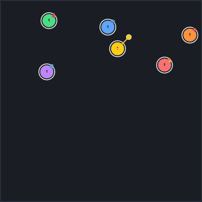
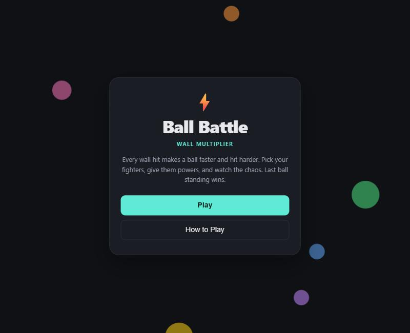

# ⚡ Ball Battle: Wall Multiplier

A chaotic browser battle simulator. Balls bounce around an arena, and **every wall hit makes them faster and hit harder**. Give each fighter a power, press Start, and watch who's left standing.

### [▶ Play it in your browser](https://doggieshrimp.github.io/Ball-battle/)

<p align="center">
  
</p>

## How to play

1. Open the game and press **Play**.
2. Set up your fighters: edit each ball's **name**, **HP**, **damage** and **power**. Use the slider or **+ Add Ball** for 2–10 balls.
3. Press **Start** and watch the battle play out.
4. The ring around each ball is its HP. The last ball alive wins.

Press **Pause** at any time, or **← Menu** / **Esc** to go back to the main menu (the battle waits for you).

### Rules

- Each wall hit **multiplies a ball's damage** (×2 by default) and **boosts its speed** (+4.5% by default).
- When two balls collide, each one deals its damage to the other.
- After being hit, a ball is invulnerable for a moment (it flickers).
- The wall multipliers can be changed under **Battle settings**.

## Powers

| Power | What it does |
|---|---|
| 🔥 **Fire** | Sets enemies on fire: 4 burn ticks, each dealing 15% of the attacker's damage. |
| ❄️ **Ice** | Slows enemies to 40% speed for 1.5 seconds. |
| ⚡ **Shock** | Stuns enemies in place for half a second. |
| 🩸 **Vampire** | Heals for 30% of the damage it deals. |
| 🌀 **Rod** | A spinning rod hits anything it touches. It grows longer and spins faster with every wall hit. |
| 🧪 **Poison** | Stacking poison that drains 0.4% of the enemy's max HP per tick. Repeated hits add more ticks. |
| 🛡️ **Shield** | Blocks half the damage from a hit (including rod hits), then recharges for 2 seconds. |
| 💥 **Blast** | Knocks enemies flying on impact. |
| 💚 **Regen** | Heals 0.1% of its max HP every second. |

Status effects can't be refreshed while they're still active, so no power can lock an enemy down forever.

<p align="center">
  
</p>

## How it's built

- **Plain HTML, CSS and JavaScript.** No frameworks, libraries or build step. The whole game is one [`index.html`](index.html) file.
- **Canvas 2D rendering** at the screen's pixel density, so it stays sharp on high-DPI and phone screens.
- **A custom physics loop** using `requestAnimationFrame`: movement, wall bounces, elastic ball-to-ball collisions with overlap correction, and a speed cap so things don't spiral out of control.
- **A status-effect system**: burn, slow, stun, poison stacks, shield cooldowns and rod hit cooldowns are tracked per ball, frame by frame.
- **Efficient UI updates**: the fighter list is built once per battle, and each frame only changes the numbers that changed.
- **Responsive layout** with light and dark themes that follow your system setting.

## Run it locally

No install needed. Clone the repo and open `index.html` in any modern browser:

```bash
git clone https://github.com/doggieshrimp/Ball-battle.git
```
